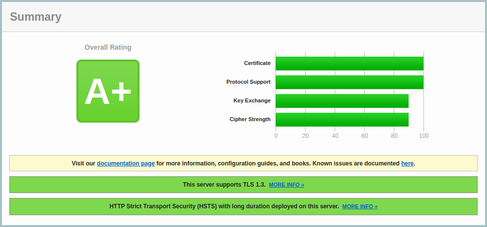

# NetService
*HTTP/S server and websocket support for Next.js/React with TLS, security headers, and middleware support.*  

NetService provides a simple way to run a production ready site with HTTPS, middleware, and WebSocket support, while enforcing security best practices. 

---

## Key Features

| Feature                     | Description                                                                 |
|-----------------------------|-----------------------------------------------------------------------------|
| **Automatic TLS**           | HTTPS in production, HTTP for `localhost`                                  |
| **Security Headers**        | Preconfigured security headers for all responses                           |
| **Middleware Pipeline**     | Modular request processing (rate limiting, blocking, etc.)                 |
| **Next.js Compatibility**   | Works as a custom server for Next.js                                        |
| **WebSocket Support**       | Built-in WebSocket server with event-driven API                            |

---  

*SSL rating aquired by NetService out of the box*  
  
#### *SSL rating by: [Qualys SSL Labs](https://www.ssllabs.com/index.html)*  

---

## Quick Start

### Installation
```bash
npm install netservice
```

---

## Configuration

### Prerequisites
For port-binding permissions (Linux):
```bash
sudo setcap 'cap_net_bind_service=+ep' $(which node)
```

### Environment Variables
Add to `.env`:
```env
DOMAIN="yourdomain.com"      # Production domain ('localhost' for dev)
DIR_SSL="/path/to/certs/"    # Path to SSL certificates
TLS_CIPHERS="..."            # OpenSSL cipher string (optional)
TLS_MINVERSION="TLSv1.2"     # Minimum TLS version
TLS_MAXVERSION="TLSv1.3"     # Maximum TLS version
ENABLE_NEXTJS="true"         # Enable Next.js support
```

### SSL Certificates
Place in `DIR_SSL`:
- **Production:** `private.key`, `certificate.crt`, `ca_bundle.crt`
- **Development (Optional):** `localhost.key`, `localhost.crt`

#### Generate Self-Signed Certificates (Dev)
```bash
openssl req -x509 -out localhost.crt -keyout localhost.key \
  -newkey rsa:2048 -nodes -sha256 \
  -subj '/CN=localhost' -extensions EXT -config <( \
   printf "[dn]\nCN=localhost\n[req]\ndistinguished_name=dn\n[EXT]\nsubjectAltName=DNS:localhost\nkeyUsage=digitalSignature\nextendedKeyUsage=serverAuth")
```

---

## Basic Usage

### Starting the Server
```javascript
import NetService from 'netservice';

const netservice = new NetService(process.env.DOMAIN);
netservice.listen(() => {
  console.log('Server ready!');
});
```

### Events
```javascript
netservice
  .on('ready', () => console.log('Server ready!'))
  .on('error', (err) => console.error('Server error:', err));
```

---

## Middleware

### Built-in Middleware
- `netservice.Safety.mwRateLimit()`: Rate-limiting by IP/URL
- `netservice.Safety.mwBlockList()`: Block specific paths

#### Registering Middleware
```javascript
netservice
  .register('*', netservice.Safety.mwRateLimit())
  .register('*', netservice.Safety.mwBlockList())
  .register('/api', async (req, res) => {
    if (!req.headers.authorization) {
      res.writeHead(401).end('Unauthorized');
      return res; // Ends middleware chain
    }
    // Return undefined to continue
  });
```

#### Middleware Signature (TypeScript)
```typescript
type Middleware = (
  req: IncomingMessage,
  res: ServerResponse
) => Promise<undefined | ServerResponse>;
```

---

## WebSocket Support

### WebSocket Events
| Event       | Description                          |
|-------------|--------------------------------------|
| `zREADY`    | New WebSocket connection established |
| `zMESSAGE`  | Incoming WebSocket message           |
| `zCLOSE`    | WebSocket connection closed          |
| `zERROR`    | WebSocket error                      |

#### Example
```javascript
netservice
  .on('zREADY', ({ client, req }) => {
    console.log('New WebSocket client connected');
  })
  .on('zMESSAGE', ({ client, data }) => {
    console.log('Received:', data.toString());
    client.send('Message received');
  });
```

---

## Security

### Default Security Headers
| Header                     | Value                                                                 |
|----------------------------|-----------------------------------------------------------------------|
| `Strict-Transport-Security`| `max-age=31536000; includeSubDomains; preload`                        |
| `X-Frame-Options`          | `SAMEORIGIN`                                                          |
| `X-Content-Type-Options`   | `nosniff`                                                             |
| `X-XSS-Protection`         | `1; mode=block`                                                       |

---

## Events

| Event   | Description                          |
|---------|--------------------------------------|
| `ready` | Server startup completion            |
| `error` | Critical failure notifications       |

---

## Advanced Usage

### Graceful Shutdown
```javascript
process.on('SIGINT', async () => {
  await netservice.Safety.cleanup();
  process.exit(0);
});
```

---

## Contributing

We welcome contributions! Focus areas:
- TLS hardening
- Additional middleware utilities

